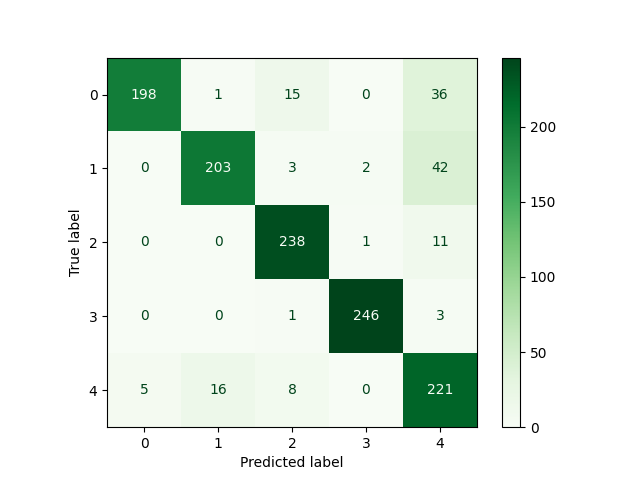

# Deepfake Image Classification - Project Documentation

## Index
- [The Project](#1-the-project)  
- [ML Models](#2-ml-models)  
- [CNN Runs](#3-cnn-runs)  
- [Random Forest Runs](#4-random-forest-runs)  
- [Data Preprocessing and Augmentation](#5-data-preprocessing-and-augmentation)  
- [Hyperparameters](#6-hyperparameters)    
- [Performance](#7-performance)  
- [Implementation](#8-implementation)  
- [Bad runs](#9-bad-runs)  
- [Comparasion](#10-comparasion)  
- [Conclusions](#11-conclusions)  

---


### Task
Image classification challenge in which competitors train classification models on a data set containing deepfake images generated by deep generative models. Competitors are scored based on the classification accuracy on a given test set. For each test image, the participants have to predict its class label.

### Dataset
- `Training Set:` 12,500 labeled images for model training
- `Validation Set;` 1,250 labeled images for performance evaluation during development
- `Test Set:` 6,500 unlabeled images for final evaluation

All images are PNG format with identical dimensions (100 X 100 X 3).
The five classes represent different deepfake generated images, requiring models to identify specific characteristics that the competitor doesn't actually know.

### Evaluation 
Performance is primarily measured by classification accuracy on the validation set. Additional evaluation includes:
- Analyzing class confusion patterns using confusion matrices
- Monitoring overfitting through training vs validation accuracy comparison

---

## 2. ML Models

### 1. Convolutional Neural Networks (CNN)
CNNs serve as the primary approach for this image classification task. These networks are designed specifically for visual data processing and offer several advantages:
- `Hierarchical Feature Learning:` Progress from simple patterns (edges, textures) to complex concepts
- `Spatial Information Preservation:` Maintain pixel neighborhood relationships
- `Translation Invariance:` Detect patterns regardless of location in the image
- `Parameter Efficiency:` Share weights across the image to reduce complexity

**CNN Processing:** raw RGB pixel data through multiple stages:
1. Early layers detect basic visual patterns
2. Pooling layers reduce spatial dimensions while preserving important features
3. Deeper layers combine simple patterns into complex visual concepts
4. Final layers map learned features to final class predicitions

### 2. Random Forest Classification
Random Forest provides an alternative approach using decision trees:
- `Bootstrap Sampling:` Train multiple trees on random data subsets
- `Random Feature Selection:` Each tree uses random feature subsets for decisions
- `Majority Voting:` Final prediction combines all tree predictions
- `Distribution-Free:` Makes no assumptions about data distribution

**Random Forest Processing:** requires image-to-vector conversion:
1. Flatten 2D image arrays into 1D feature vectors
2. Treat each pixel intensity as an independent feature
3. Build decision trees using pixel value threshold rules
4. Combine multiple tree predictions through voting

### Feature Processing Comparison

#### CNN Feature Processing
CNNs maintain spatial structure throughout processing:
- `Input:` Height × Width × Channels (RGB) tensors
- `Filters:` Detect patterns across image regions
- `Progressive` Complexity: Build from edges to semantic objects
- `Spatial Pooling:` Reduce dimensions while maintaining spatial relationships

#### Random Forest Feature Processing
Random Forest treats images as tabular data:
- `Input Format:` Flat vectors of length (Height × Width × Channels)
- `Independent Features:` Each pixel processed separately
- `Rule-Based Learning:` Trees learn threshold rules on pixel intensities
- `Spatial Blindness:` Loses geometric relationships between pixels

---

## 3. CNN Runs

| Run ID           | Date       | Optimizer | Learning Rate | Batch Size | Epochs | Architecture                                | Pooling                | Regularization | Data Augmentation                  | Training Accuracy | Validation Accuracy | Accuracy Gap | Confusion Matrix                                                                    |
|------------------|------------|-----------|---------------|------------|--------|---------------------------------------------|------------------------|----------------|------------------------------------|-------------------|---------------------|--------------|-------------------------------------------------------------------------------------|
| 03_06_2025-14:26 | 2025-06-03 | SGD       | default       | 8          | 3      | 3 Conv (32,64,128) + 1 Dense (128)          | MaxPooling2D           | None           | None                               | N/A               | N/A                 | N/A          | N/A                                                                                 |
| 04_06_2025-15:52 | 2025-06-04 | SGD       | default       | 128        | 100    | 3 Conv (64,128,256) + 2 Dense (256,128)     | MaxPooling2D           | L2(0.001)      | None                               | 0.7895            | 0.7584              | 0.0311       |                |
| 04_06_2025-16:05 | 2025-06-04 | SGD       | default       | 512        | 150    | 3 Conv (64,128,256) + 2 Dense (256,128)     | MaxPooling2D           | L2(0.001)      | None                               | 0.7490            | 0.7240              | 0.0250       |                |
| 04_06_2025-16:14 | 2025-06-04 | SGD       | default       | 256        | 120    | 3 Conv (64,128,256) + 2 Dense (256,128)     | MaxPooling2D           | L2(0.001)      | None                               | 0.7874            | 0.7624              | 0.0250       |                |
| 04_06_2025-16:36 | 2025-06-04 | SGD       | default       | 256        | 120    | 3 Conv (64,128,256) + 2 Dense (256,128)     | MaxPooling2D           | L2(0.001)      | None                               | 0.8142            | 0.7752              | 0.0390       |      |
| 04_06_2025-16:57 | 2025-06-04 | Adam      | default       | 256        | 120    | 3 Conv (64,128,256) + 2 Dense (256,128)     | MaxPooling2D           | L2(0.001)      | None                               | 0.9274            | 0.8520              | 0.0754       |      |
| 04_06_2025-18:37 | 2025-06-04 | Adam      | default       | 256        | 120    | 3 Conv (64,128,256) + 2 Dense (256,128)     | MaxPooling2D           | L2(0.001)      | R:0.1, F:hor, Z:0.2, B:0.1, S:0.1  | 0.2000            | 0.2000              | 0.0000       |                |
| 04_06_2025-18:44 | 2025-06-04 | Adam      | default       | 256        | 120    | 3 Conv (64,128,256) + 2 Dense (256,128)     | MaxPooling2D           | L2(0.001)      | R:0.1, F:hor, Z:0.05, B:0.1, S:0.1 | 0.2000            | 0.2000              | 0.0000       |                |
| 04_06_2025-18:50 | 2025-06-04 | Adam      | default       | 256        | 120    | 3 Conv (64,128,256) + 2 Dense (256,128)     | MaxPooling2D           | L2(0.001)      | F:hor, R:0.1                       | 0.8124            | 0.7824              | 0.0300       |                |
| 04_06_2025-18:53 | 2025-06-04 | Adam      | default       | 256        | 120    | 3 Conv (64,128,256) + 2 Dense (256,128)     | MaxPooling2D           | L2(0.001)      | F:hor, R:0.01                      | 0.8278            | 0.8112              | 0.0166       |                |
| 04_06_2025-19:05 | 2025-06-04 | Adam      | default       | 256        | 120    | 3 Conv (64,128,256) + 2 Dense (256,128)     | MaxPooling2D           | L2(0.001)      | F:hor, R:0.05                      | 0.8362            | 0.8064              | 0.0298       |                |
| 04_06_2025-19:10 | 2025-06-04 | Adam      | default       | 256        | 120    | 3 Conv (64,128,256) + 2 Dense (256,128)     | MaxPooling2D           | L2(0.001)      | F:hor, R:0.05                      | 0.8170            | 0.7936              | 0.0234       |                |
| 04_06_2025-19:13 | 2025-06-04 | Adam      | default       | 256        | 120    | 3 Conv (64,128,256) + 2 Dense (256,128)     | Flatten                | L2(0.001)      | F:hor, R:0.05                      | 0.9147            | 0.8776              | 0.0371       |  |
| 04_06_2025-19:30 | 2025-06-04 | Adam      | default       | 256        | 120    | 3 Conv (64,128,256) + 2 Dense (256,128)     | GlobalAveragePooling2D | L2(0.001)      | F:hor, R:0.05                      | 0.8726            | 0.8392              | 0.0334       |                |
| 04_06_2025-19:38 | 2025-06-04 | Adam      | default       | 256        | 120    | 4 Conv (64,128,256,512) + 2 Dense (256,128) | GlobalAveragePooling2D | L2(0.001)      | F:hor, R:0.05                      | 0.7875            | 0.7736              | 0.0139       |                |
| 04_06_2025-19:44 | 2025-06-04 | Adam      | default       | 256        | 120    | 4 Conv (64,128,256,512) + 2 Dense (256,128) | GlobalAveragePooling2D | L2(0.001)      | F:hor, R:0.05                      | 0.8721            | 0.8360              | 0.0361       |      |
| 05_06_2025-17:14 | 2025-06-05 | Adam      | default       | 256        | 75     | 3 Conv (64,128,256) + 2 Dense (256,128)     | Flatten                | L2(0.001)      | F:hor, R:0.05                      | 0.8828            | 0.8528              | 0.0300       |                |
| 05_06_2025-17:49 | 2025-06-05 | Adam      | default       | 256        | 75     | 3 Conv (64,128,256) + 2 Dense (256,128)     | GlobalAveragePooling2D | L2(0.001)      | F:hor, R:0.05, **Hue-only**        | 0.7626            | 0.7368              | 0.0258       |                |
| 05_06_2025-18:11 | 2025-06-05 | Adam      | default       | 256        | 120    | 3 Conv (64,128,256) + 2 Dense (256,128)     | Flatten                | L2(0.001)      | F:hor, R:0.05                      | 0.8966            | 0.8552              | 0.0414       |                |
| 05_06_2025-18:28 | 2025-06-05 | Adam      | default       | 256        | 120    | 3 Conv (64,128,256) + 2 Dense (256,128)     | Flatten                | L2(0.001)      | F:hor, R:0.05                      | 0.8906            | 0.8536              | 0.0370       |                |
| 05_06_2025-18:50 | 2025-06-05 | Adam      | default       | 256        | 120    | 3 Conv (64,128,256) + 2 Dense (256,128)     | Flatten                | L2(0.001)      | F:hor, R:0.05                      | 0.8842            | 0.8424              | 0.0418       |                |
| 05_06_2025-19:38 | 2025-06-05 | Adam      | default       | 256        | 120    | 3 Conv (64,128,256) + 2 Dense (256,128)     | Flatten                | L2(0.001)      | F:hor, R:0.05                      | 0.8203            | 0.8024              | 0.0179       |                |
| 06_06_2025-13:09 | 2025-06-06 | Adam      | 0.0005        | 256        | 120    | 3 Conv (64,128,256) + 2 Dense (256,128)     | Flatten                | L2(0.001)      | F:hor, R:0.05                      | 0.9316            | 0.8800              | 0.0516       |                |
| 06_06_2025-13:20 | 2025-06-06 | Adam      | 0.0005        | 128        | 120    | 3 Conv (64,128,256) + 2 Dense (256,128)     | Flatten                | L2(0.001)      | F:hor, R:0.05                      | 0.8950            | 0.8488              | 0.0462       |                |
| 06_06_2025-13:27 | 2025-06-06 | Adam      | 0.0005        | 256        | 120    | 3 Conv (64,128,256) + 1 Dense (64)          | GlobalAveragePooling2D | L2(0.001)      | F:hor, R:0.05                      | 0.8677            | 0.8312              | 0.0365       |                |
| 06_06_2025-13:56 | 2025-06-06 | Adam      | 0.0005        | 256        | 120    | 4 Conv (64,128,256,512) + 2 Dense (256,128) | GlobalAveragePooling2D | L2(0.01)       | F:hor, R:0.05                      | 0.8858            | 0.8464              | 0.0394       |                |
| 06_06_2025-14:04 | 2025-06-06 | Adam      | 0.0005        | 256        | 120    | 4 Conv (64,128,256,512) + 2 Dense (256,128) | GlobalAveragePooling2D | L2(0.01)       | F:hor, R:0.05                      | 0.9273            | 0.8744              | 0.0529       |                |
| 06_06_2025-14:12 | 2025-06-06 | Adam      | 0.0005        | 256        | 120    | 3 Conv (64,128,256) + 2 Dense (256,128)     | GlobalAveragePooling2D | L2(0.01)       | F:hor, R:0.05                      | 0.8786            | 0.8560              | 0.0226       |                |
| 06_06_2025-14:22 | 2025-06-06 | Adam      | 0.0003        | 256        | 120    | 4 Conv (64,128,256,512) + 2 Dense (256,128) | GlobalAveragePooling2D | L2(0.01)       | F:hor, R:0.05                      | 0.9379            | 0.8768              | 0.0611       |                |
| 06_06_2025-14:33 | 2025-06-06 | Adam      | 0.0002        | 256        | 120    | 4 Conv (64,128,256,512) + 2 Dense (256,128) | Flatten                | L2(0.01)       | F:hor, R:0.05                      | 0.8754            | 0.8344              | 0.0410       |                |
| 06_06_2025-14:55 | 2025-06-06 | Adam      | 0.0005        | 256        | 120    | 4 Conv (64,128,256,512) + 2 Dense (256,128) | GlobalAveragePooling2D | L2(0.01)       | F:hor, R:0.05                      | 0.9098            | 0.8848              | 0.0250       |                |


### CNN Performance Analysis

`Top Performing Models:` The highest validation accuracy reached 88.48% (run `06_06_2025-14:55`). 


Analysis of top-performing models reveals consistent patterns:
1. `06_06_2025-14:55:` 88.48% validation accuracy with 4-layer architecture
2. `06_06_2025-13:09:` 88.00% validation accuracy with 3-layer architecture  
3. `04_06_2025-19:13:` 87.76% validation accuracy with 3-layer architecture

**Success Factors:**
- Adam optimizer consistently outperformed SGD
- Balanced data augmentation strategies improved generalization
- Proper regularization prevented overfitting
- Optimal learning rate selection enhanced convergence

**Training Failures:**  
Two experiments (`04_06_2025-18:37 `and `04_06_2025-18:44`) achieved exactly `20%` validation accuracy, equivalent to random guessing. These failures occurred due to excessive data augmentation that destroyed importatn visual features.


---

## 4. Random Forest Runs
| Run ID           | Date       | Model Type    | N_Estimators | Max_Depth | Preprocessing       | Training Accuracy | Validation Accuracy | Accuracy Gap | Confusion Matrix                                                                    |
|------------------|------------|---------------|--------------|-----------|---------------------|-------------------|---------------------|--------------|-------------------------------------------------------------------------------------|
| 06_06_2025-17:51 | 2025-06-06 | Random Forest | 400          | 40        | Flatten + Normalize | 1.0000            | 0.6152              | 0.3848       |  |
| 06_06_2025-17:53 | 2025-06-06 | Random Forest | 350          | 23        | Flatten + Normalize | 0.9996            | 0.6176              | 0.3820       |  |
| 06_06_2025-20:28 | 2025-06-06 | Random Forest | 500          | 20        | Flatten + Normalize | 0.9982            | 0.6216              | 0.3766       |  |
| 06_06_2025-20:31 | 2025-06-06 | Random Forest | 700          | 15        | Flatten + Normalize | 0.9755            | 0.6048              | 0.3707       |  |


### Random Forest Implementation
Random Forest method treats image classification as a tabular data problem rather than a visual recognition task.

**Data Preparation:**
Images required conversion from 2D arrays to 1D feature vectors, transforming spatial visual data into tabular format where each pixel intensity becomes an independent feature.

```python
def preprocess_images_and_labels(images, labels=None):
    normalized_images = images / 255.0
    flattened_images = normalized_images.reshape(normalized_images.shape[0], -1)
    return flattened_images, labels
```

### Random Forest Analysis

`Parameter Impact:`
Testing different tree quantities (350 to 700) showed optimal performance around 500 trees. The highest validation accuracy of 62.16% was achieved with 500 trees, while 700 trees decreased performance to 60.48%.

`Tree Depth:`
Tree depth significantly affected both training and validation performance:
- `Depth 40:` Perfect training accuracy (100%) with severe overfitting
- `Depth 20:` Best validation performance (62.16%) with moderate overfitting
- `Depth 15:` Reduced overfitting but lower overall performance

`Overfitting:`
All Random Forest configurations have severe overfitting with accuracy gaps ranging from 37.07% to 38.48%, indicating serious limitations when applying Random Forest to image classification tasks.

---

## 5. Data Preprocessing and Augmentation

### Basic Data Processing
All models received identical preprocessing for fair comparison:
1. `Pixel Normalization:` Convert from [0,255] to [0,1] range
2. `Format Consistency:` Maintain RGB channel ordering

### CNN Data Augmentation
Data augmentation techniques were systematically tested to improve model generalization:

**Augmentation Types:**
- `F:hor` -> Horizontal flips applied 50% of the time
- `R:0.05` -> Random rotation within ±5 degrees
- `R:0.1` -> Random rotation within ±10 degrees  
- `Z:0.05/0.2` -> Zoom scaling by 5% or 20%
- `B:0.1` -> Brightness adjustment by ±10%
- `S:0.1` -> Spatial shifting up to 10% of dimensions

**Augmentation results:**
Moderate augmentation (horizontal flips + small rotations) consistently improved validation performance by 2-4%. However, more augmentation caused complete training failure, indicating that deepfake detection requires preservation of subtle visual features.

### Color Space Experiments
Extracted hue channel from HSV color space instead of full RGB, based on observed brightness variations between deepfake classes.

**Hue-Only Results `(05_06_2025-17:49)`:**
- Validation accuracy: 73.68%
- Performance decrease: 14.8% compared to RGB

### Random Forest Feature Engineering
Random Forest required specific data transformation:
- `Feature Vectors:` Flatten (Height × Width × 3) arrays into 1D vectors
- `Independent Processing:` Treat each pixel as unrelated to others
- `Spatial Information Loss:` Eliminate geometric relationships between pixels

---

## 6. Hyperparameters

### Optimizer Comparison
**SGD vs Adam Performance:**
Direct comparison between optimizers revealed significant performance differences:
- `SGD Results:` 72.40% - 77.52% validation accuracy
- `Adam Results:` 73.68% - 88.48% validation accuracy

Adam's adaptive learning rate proved essential for learning complex deepfake features, while SGD's fixed learning rate was not the one to choose for optimal performance.

### Learning Rate Analysis
**Adam Learning Rate Testing:**
- `0.0005:` Optimal performance (88.48% maximum validation accuracy)
- `0.0003:` Suboptimal results (87.68% validation accuracy)
- `0.0002:` Reduced effectiveness (83.44% validation accuracy)
- `Default (~0.001):` Variable results (73.68% - 88.00% range) because of other hyperparameters changes

Learning rate 0.0005 provided the best balance between learning speed and final performance.

### Batch Size Impact
**Batch Processing Results:**
- `Batch 8:` Insufficient for stable learning
- `Batch 128:` Moderate performance (84.88% validation accuracy)
- `Batch 256:` Optimal performance across experiments
- `Batch 512:` Significant decrease (72.40% validation accuracy)

Batch size 256 achieved the best estimation quality.

### Architecture Depth Analysis
**3-Layer vs 4-Layer Networks:**
- `3-Layer Best:` 88.00% validation accuracy with improved stability
- `4-Layer Best:` 88.48% validation accuracy with increased capacity

### Pooling Strategy Comparison
**Pooling Method Results:**
- `MaxPooling2D;` Traditional approach with reliable baseline performance
- `GlobalAveragePooling2D:` Superior generalization with optimal validation accuracy
- `Flatten:` Good performance but increased parameter requirements

GlobalAveragePooling2D with appropriate regularization got the best performance.

---

## 7. Performance

### CNN Confusion Matrix Analysis
**Best CNN Performance (88.48% Validation Accuracy):**
The best CNN model displays strong diagonal patterns in its confusion matrix, indicating effective separation between classes. Minimal off-diagonal errors suggest successful learning of distinguishing features across all deepfake categories.  



**Failed CNN Performance (20% Validation Accuracy):**
Completely failed models show uniform confusion across all classes, with no discernible pattern indicating total failure to learn meaningful features.  


### Random Forest Confusion Matrix Patterns
**Best Random Forest Performance (62.16% Validation Accuracy):**
Random Forest confusion matrices exhibit weaker diagonal patterns compared to CNNs, with systematic biases toward specific classes. This reflects the model's inability to understand spatial relationships essential for deepfake detection.  


### Model Comparison Analysis

CNNs show clear diagonal predicts in their confusion matrices, indicating effective class separation and consistent generalization across all categories. Obn the other hand, Random Forest exhibits weaker diagonal patterns, with noticeable inter-class confusion.

---

## 8. Implementation

### Best CNN Architecture (`06_06_2025-14:55`)
```
Input: RGB Image Tensor (Height × Width × 3)
├── RandomFlip(horizontal)
├── RandomRotation(0.05)

├── Conv2D(64 filters, 3×3 kernel, padding='same') + BatchNormalization + ReLU
├── Conv2D(64 filters, 3×3 kernel, padding='same') + BatchNormalization + ReLU
├── MaxPooling2D(2×2) + Dropout(0.25)

├── Conv2D(128 filters, 3×3 kernel, padding='same') + BatchNormalization + ReLU
├── Conv2D(128 filters, 3×3 kernel, padding='same') + BatchNormalization + ReLU
├── MaxPooling2D(2×2) + Dropout(0.25)

├── Conv2D(256 filters, 3×3 kernel, padding='same') + BatchNormalization + ReLU
├── Conv2D(256 filters, 3×3 kernel, padding='same') + BatchNormalization + ReLU
├── MaxPooling2D(2×2) + Dropout(0.5)

├── Conv2D(512 filters, 3×3 kernel, padding='same') + BatchNormalization + ReLU
├── Conv2D(512 filters, 3×3 kernel, padding='same') + BatchNormalization + ReLU
├── MaxPooling2D(2×2) + Dropout(0.5)

├── GlobalAveragePooling2D
├── Dense(256 units, ReLU, L2(0.01)) + Dropout(0.5)
├── Dense(128 units, ReLU, L2(0.01)) + Dropout(0.4)
└── Dense(5 units, Softmax)
```

### Training Configuration
**CNN Training Parameters:**
- Framework: Tensorflow
- Loss Function: Categorical Crossentropy
- Metrics: Classification Accuracy
- Callbacks: EarlyStopping, ModelCheckpoint, ReduceLROnPlateau
- Training Duration: 75-120 epochs with early stopping

**Random Forest Training Parameters:**
- Framework: scikit-learn
- Parallel Processing: n_jobs=-1 for full CPU utilization

---

## 9. Bad runs

### CNN Bad Runs
**Excessive Augmentation Impact:**
Experiments `04_06_2025-18:37` and `04_06_2025-18:44` demonstrated that excessive data augmentation destroys critical deepfake detection features. Combining 10° rotation, 20% zoom, 10% brightness changes, and 10% saturation changes caused complete training collapse.

**SGD Optimization Limitations:**
All SGD-based experiments achieved suboptimal performance, with the best SGD result (77.52%) worse than Adam-based approaches. This demonstrates the importance of adaptive learning rates.

**Single Color Channel Constraints:**
The hue-only processing experiment (73.68% accuracy) revealed that single-channel information is insufficient for good deepfake detection, showing the need for complete color information.

### Random Forest Limitations
**Losing Spatial Information:**
The primary limitation of Random Forest for images comes from the required flattening operation, which destroys spatial relationships between pixels.

**Serious Overfitting:**
All Random Forest configurations showed training accuracies above 97% while validation accuracies remained below 63%, indicating memorizing training dataset instead of pattern learning.

**Big data structures:**
Random Forest struggles to generalize well when working with feature vectors containing thousands of pixel values, even though it performs well on the training data. This is due to the challenges of handling high-dimensional data.

---

## 10. Comparasion

### Performance Summary
CNNs achieved 88.48% best validation accuracy with 83-85% average performance and 2-5% training-validation gap. Random Forest reached 62.16% best validation accuracy with 61% average performance and 37-38% training-validation gap.

### Model Analysis
**CNN Advantages:**
- Preserves spatial relationships through convolution operations
- Learns hierarchical features from simple to complex patterns
- Translation invariant enabling robust pattern detection
- Controls overfitting through regularization techniques

**Random Forest Advantages:**
- Good at catching pixel outliers
- Provides feature importance scores

**Performance Gap Analysis:**
The 26.32 percentage point difference (88.48% vs 62.16%) between best CNN and Random Forest performance demonstrates the critical importance of preserving spatial relationships in image classification tasks.

### Best configuration
**Optimal CNN Setup for Deepfake Detection:**
- `Architecture:` 4-layer CNN with progressive filter expansion (64-128-256-512)
- `Pooling:` GlobalAveragePooling2D for overfitting reduction
- `Optimization:` Adam with learning rate 0.0005
- `Regularization:` L2(0.01) + Dropout + BatchNormalization
- `Augmentation:` Horizontal flips + 5° rotation only (needs to be minimal)
- `Expected Performance:` 88.5% validation accuracy

---

## 11. Conclusions
- `Spatial Features are Important:` CNNs' 43% relative performance advantage over Random Forest demonstrates that spatial relationships are critical for deepfake detection
- `Optimizer Selection Matters:` Adam consistently outperformed SGD by 10-15% across all configurations
- `Augmentation, but not too Aggresive:` Moderate augmentation improves performance while excessive augmentation destroys distinguishing features
- `RGB over Hue:` Hue-only processing resulted in 14.8% performance drop
- `Architecture Depth Provides some Gains:` 4-layer networks slightly outperformed 3-layer variants with appropriate regularization
